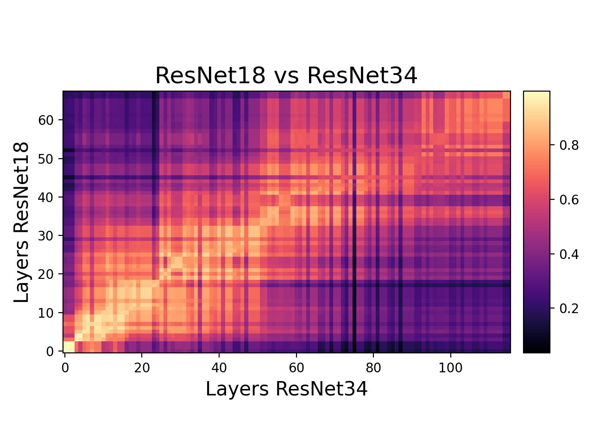
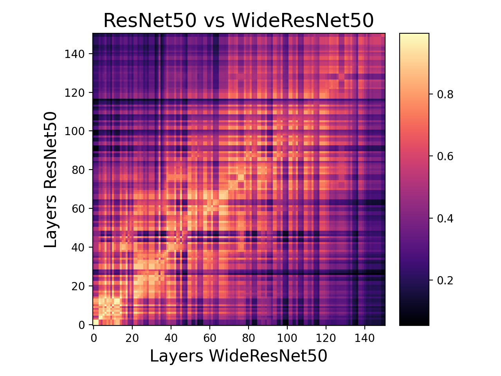
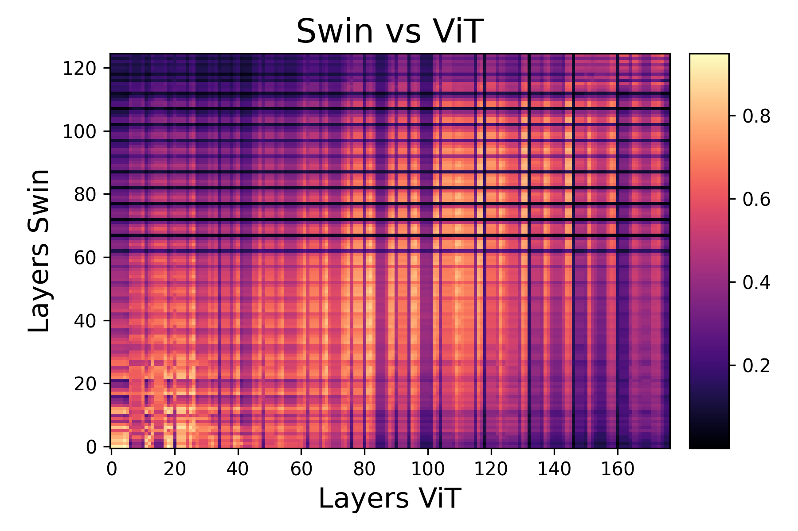
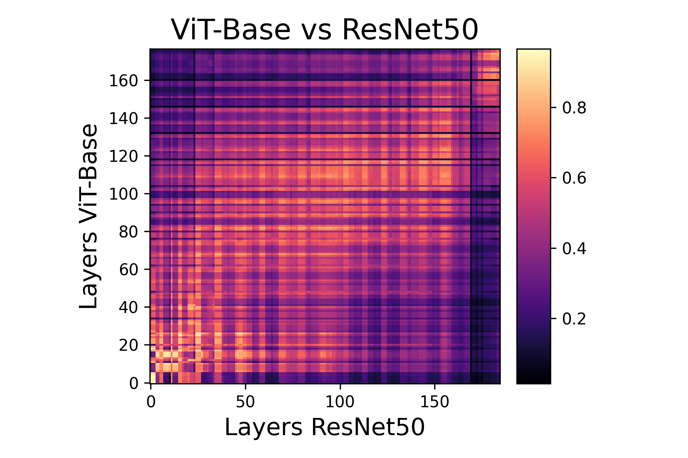
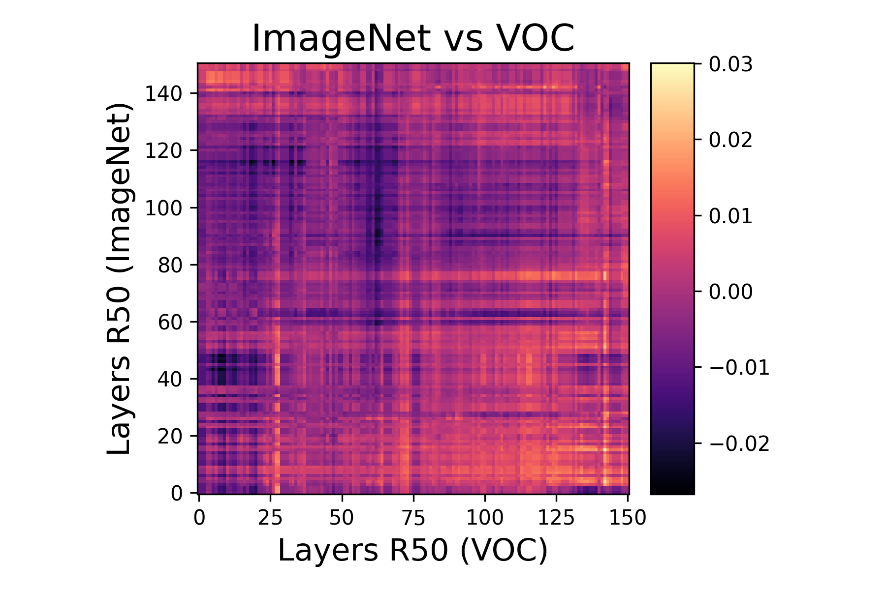

# Rebuttal for Mask Feat
This is a temporary, anonymous repository for additional explanations of the questions/comments raised by NeurIPS 2022 reviewers.


## 1. About Centered Kernel Alignment
Centered Kernel Alignment (CKA) is a representation similarity metric that is widely used for understanding the representations learned by neural networks. Specifically, CKA takes two feature maps / representations ***X*** and ***Y*** as input and computes their normalized similarity (in terms of the Hilbert-Schmidt Independence Criterion (HSIC)) as


Where ***K*** and ***L*** are similarity matrices of ***X*** and ***Y*** respectively.


However, naive computation of linear CKA requires maintaining the activations across the entire dataset in memory, which is challenging for wide and deep networks. To reduce memory consumption, a minibatch version of CKA was proposed to compute linear CKA by averaging HSIC scores over <span style="color:blue">*k*</span> minibatches:

<!-- However, the above formula is not scalable against deep architectures and large datasets. Therefore, a minibatch version can be constructed that uses an unbiased estimator of the HSIC as -->

<!--  -->
<!--  -->


`More details can be found in the 2021 ICLR paper` published by [Nguyen T., Raghu M, Kornblith S](https://arxiv.org/abs/2010.15327).

## Getting Started

<!-- ### Installation
```
pip install torch_cka
``` -->

### Usage
```python
from torch_cka import CKA
model1 = resnet18(pretrained=True)  # Or any neural network of your choice
model2 = resnet34(pretrained=True)

dataloader = DataLoader(your_dataset, 
                        batch_size=batch_size, # according to your device memory
                        shuffle=False)  # Don't forget to seed your dataloader

cka = CKA(model1, model2,
          model1_name="ResNet18",   # good idea to provide names to avoid confusion
          model2_name="ResNet34",   
          model1_layers=layer_names_resnet18, # List of layers to extract features from
          model2_layers=layer_names_resnet34, # extracts all layer features by default
          device='cuda')

cka.compare(dataloader) # secondary dataloader is optional

results = cka.export()  # returns a dict that contains model names, layer names
                        # and the CKA matrix
```

## Examples
`torch_cka` can be used with any pytorch model (subclass of `nn.Module`) and can be used with pretrained models available from popular sources like torchHub, timm, huggingface etc. Some examples of where this package can come in handy are illustrated below.

### Comparing the effect of Depth
A simple experiment is to analyse the features learned by two architectures of the same family - ResNets but of different depths. Taking two ResNets - ResNet18 and ResNet34 - pre-trained on the Imagenet dataset, we can analyse how they produce their features on, say CIFAR10 for simplicity. This comparison is shown as a heatmap below. 



We see high degree of similarity between the two models in lower layers as they both learn similar representations from the data. However at higher layers, the similarity reduces as the deeper model (ResNet34) learn higher order features which the is elusive to the shallower model (ResNet18). Yet, they do indeed have certain similarity in their last fc layer which acts as the feature classifier.

### Comparing Two Similar Architectures
Another way of using CKA is in ablation studies. We can go further than those ablation studies that only focus on resultant performance and employ CKA to study the internal representations. Case in point - ResNet50 and WideResNet50 (k=2). WideResNet50 has the same architecture as ResNet50 except having wider residual bottleneck layers (by a factor of 2 in this case).



We clearly notice that the learned features are indeed different after the first few layers. The width has a more pronounced effect in deeper layers as compared to the earlier layers as both networks seem to learn similar features in the initial layers. 

As a bonus, here is a comparison between ViT and the latest SOTA model [Swin Transformer](https://arxiv.org/abs/2103.14030) pretrained on ImageNet22k.




### Comparing quite different architectures
CNNs have been analysed a lot over the past decade since AlexNet. We somewhat know what sort of features they learn across their layers (through visualizations) and we have put them to good use. One interesting approach is to compare these understandable features with newer models that don't permit easy visualizations (like recent vision transformer architectures) and study them. This has indeed been a hot research topic (see [Raghu et.al 2021](https://arxiv.org/abs/2108.08810)).



### Comparing Datasets 
Yet another application is to compare two datasets - preferably two versions of the data. This is especially useful in production where data drift is a known issue. If you have an updated version of a dataset, you can study how your model will perform on it by comparing the representations of the datasets. This can be more telling about actual performance than simply comparing the datasets directly. 

This can also be quite useful in studying the performance of a model on downstream tasks and fine-tuning. For instance, if the CKA score is high for some features on different datasets, then those can be frozen during fine-tuning. As an example, the following figure compares the features of a pretrained Resnet50 on the Imagenet test data and the VOC dataset. Clearly, the pretrained features have little correlation with the VOC dataset. Therefore, we have to resort to fine-tuning to get at least satisfactory results.




## Tips
- If your model is large (lots of layers or large feature maps), try to extract from select layers. This is to avoid out of memory issues. 
- If you still want to compare the entire feature map, you can run it multiple times with few layers at each iteration and export your data using `cka.export()`. The exported data can then be concatenated to produce the full CKA matrix.
- Give proper model names to avoid confusion when interpreting the results. The code automatically extracts the model name for you by default, but it is good practice to label the models according to your use case.
- When providing your dataloader(s) to the `compare()` function, it is important that they are [seeded properly](https://pytorch.org/docs/stable/data.html#data-loading-randomness) for reproducibility. 
- When comparing datasets, be sure to set `drop_last=True` when building the dataloader. This resolves shape mismatch issues - especially in differently sized datasets.


